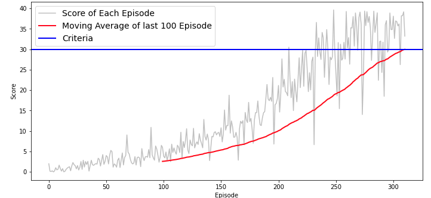

## Learning Algorithm

The agent is trained with the DDPG algorithm.

- Initialize the replay memory to some capacity.
- Initialize the local Actor and Critic network. 
- Actor network does the policy approximation 
- Critic does the value estimation.
- After each iteration, copy those generated weights into the target Actor and target Critical network.
- Train the agent for some episodes and for some maximum number of time-steps in each episode, unless it terminates earlier 
- The training loop is composed out of two steps: acting and learning.
- Acting step; the agent transfers the state vector over the Actor network and takes the action that is the network's output.
- Learning step, the Critic network is used as a feedback to the Actor network to adjust its weights in order to optimize the estimated value of the input state.
- Update the *target* Actor and Critic weights by making a copy of the current weights of the local Actor and Critic networks.

**Actor Network**

- input size = 33 output size = 4
- 2 hidden layers and one output layer
- each hidden layer has 256 hidden units and is followed by a ReLU activation layer
- A batch normalization layer after the first layer
- Output layer is followed by a tanh activation layer

**Critic Network**

- input size = 4 output size = 1
- 2 hidden layers and one output layer
- each hidden layer has 256 hidden units and is followed by a ReLU activation layer
- A batch normalization layer after the first layer
- Output layer is followed by a linear activation unit

**Hyperparameters**

```
BUFFER_SIZE = int(1e5)  
BATCH_SIZE = 128        
GAMMA = 0.99            
TAU = 0.001              
LR_ACTOR = 0.0001        
LR_CRITIC = 0.0001       
WEIGHT_DECAY = 0 
```

## Plot of Rewards



## Observations/Issues

* Using a Batch Normalization layer really helped.

* Using some noise may help a bit.

## Ideas for Future Work

- Prioritized Experience Replay: The idea behind the use of this replay buffer sampling technique is that not all experiences are equal, some of them are more reward valuable than others, so the agent must naturally at least distinguish between the different experiences.

