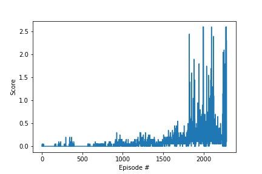

# Learning Algorithm

DDPG algorithm is implemented.

This model is composed of two networks of Actor Critic type because Continous Action Space is supposed to generate high variance.

Actor network takes a Unity Agent observation as an input and an action is generated. 
Critic network is used for the estimation of advantages for estimating the state value.

# Model Architectures and Hyperparameters

Actor passes the input which it passes without preprocessing and outputs 2 values which are the size of the space for action. Critic uses state value for compute advantages. 

## Actor

- 3 Fully connected layer
    - Fully connected layer - input: 24 (state size) output: 512
    - Fully connected layer - input: 512 output 256
    - Fully connected layer - input: 256 output: (action size -> 2)
    - Each fully connected layer is activated by ReLU and The last one is tanh for make fitting -1~1

## Critic

- 3 Fully connected layer
    - Fully connected layer - input: 33 (state size) output: 512
    - Fully connected layer - input: 512+4 output 256
    - Fully connected layer - input: 256 output: 1
    - Each fully connected layer is activated by ReLU and The last one does not activate.
    
## Hyperparameters
The all hyperparameters are specified in config.py and ddpg_agent.

- Mini batch size = 1024
- Tau = 0.001
- Gamma = 0.99
- Learning rate of actor = 0.001
- Learning rate of critic = 0.001
- Weight decay = 0
- Epsilon minimum = 0.1
- Epsilon maximum = 1.0

# Plot of Rewards

# Ideas for Future Work

* Reduce learning time by more adjusting hyper parameters